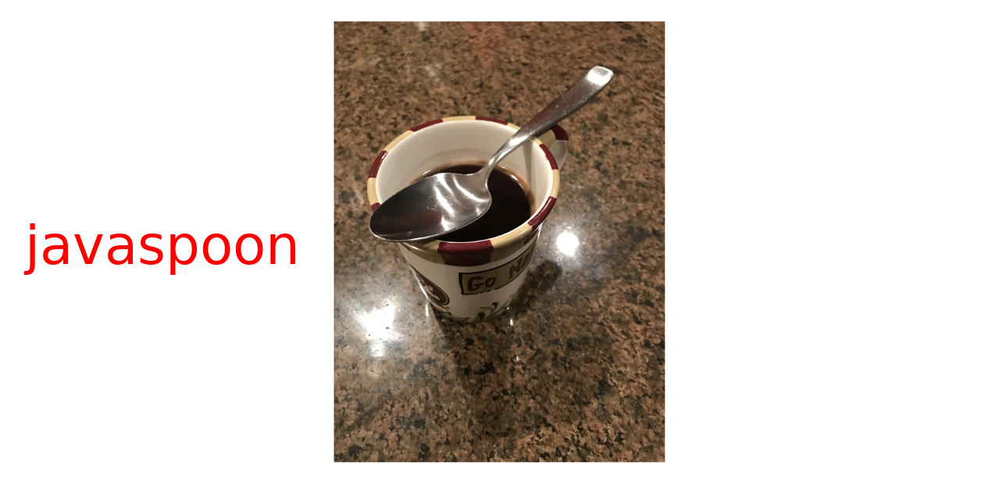

<!-- Improved compatibility of back to top link: See: https://github.com/othneildrew/Best-README-Template/pull/73 -->
<a name="readme-top"></a>
<!--
*** Thanks for checking out the Best-README-Template. If you have a suggestion
*** that would make this better, please fork the repo and create a pull request
*** or simply open an issue with the tag "enhancement".
*** Don't forget to give the project a star!
*** Thanks again! Now go create something AMAZING! :D
-->


<!-- PROJECT SHIELDS -->
<!--
*** I'm using markdown "reference style" links for readability.
*** Reference links are enclosed in brackets [ ] instead of parentheses ( ).
*** See the bottom of this document for the declaration of the reference variables
*** for contributors-url, forks-url, etc. This is an optional, concise syntax you may use.
*** https://www.markdownguide.org/basic-syntax/#reference-style-links
-->
[![Contributors][contributors-shield]][contributors-url]
[![Forks][forks-shield]][forks-url]
[![Stargazers][stars-shield]][stars-url]
[![Issues][issues-shield]][issues-url]
[![LinkedIn][linkedin-shield]][linkedin-url]


# Why use javaspoon?


<!-- PROJECT LOGO -->
<br />
<div align="center">
  <a href="https://github.com/CentralFloridaAttorney/javaspoon">
    
  </a>
<h3 align="center">javaspoon</h3>
  <p align="center">
    easy to use tools for working with data
    <br />
    <a href="https://github.com/CentralFloridaAttorney/javaspoon/wiki"><strong>Explore the Wiki»</strong></a>
    <br />
    <a href="https://github.com/CentralFloridaAttorney/javaspoon">View Demo | </a>
    <a href="https://github.com/CentralFloridaAttorney/javaspoon/issues">Report Bug | </a>
    <a href="https://github.com/CentralFloridaAttorney/javaspoon/issues">Request Feature</a>
  </p>
</div>


<!-- TABLE OF CONTENTS -->
<details>
  <summary>Table of Contents</summary>
  <ol>
    <li>
      <a href="#about-the-project">About The Project</a>
      <ul>
        <li><a href="#built-with">Built With</a></li>

      </ul>
    </li>
    <li>
      <a href="#getting-started">Getting Started</a>
      <ul>
        <li><a href="#prerequisites">Prerequisites</a></li>
        <li><a href="#installation">Installation</a></li>
      </ul>
    </li>
    <li><a href="#usage">Usage</a></li>
    <li><a href="#roadmap">Roadmap</a></li>
    <li><a href="#contributing">Contributing</a></li>
    <li><a href="#license">License</a></li>
    <li><a href="#contact">Contact</a></li>
    <li><a href="#acknowledgments">Acknowledgments</a></li>
  </ol>
</details>


<!-- ABOUT THE PROJECT -->
## About The Project

<p align="right">(<a href="#readme-top">back to top</a>)</p>

### Built With


<p align="right">(<a href="#readme-top">back to top</a>)</p>

<!-- GETTING STARTED -->
## Getting Started With javaspoon

### javaspoon helps you to eat more data

### Prerequisites

1. Install H2:
````

````
2. Install wine racks:
````
pip install mysql-connector-python
````
3. Optionally, install H2 workbench?:
````
sudo aptitude install mysql-workbench-community
````

### Installation

1. If you need help using javaspoon then [Talk to John](https://centralfloridaattorney.net/schedule-consultation/)
2. Clone the repo
   ```sh
   git clone https://github.com/CentralFloridaAttorney/javaspoon.git
   ```
3. No NPM packages to install
   ```sh
   NO npm install
   ```
4. Have fun!
   ````

<p align="right">(<a href="#readme-top">back to top</a>)</p>


<!-- USAGE EXAMPLES -->
## Usage

   
_For more examples, please refer to the [Documentation](https://example.com)_

<p align="right">(<a href="#readme-top">back to top</a>)</p>


<!-- ROADMAP -->
## Roadmap

- [ ] Feature 1
- [ ] Feature 2
- [ ] Feature 3
    - [ ] Nested Feature

See the [open issues](https://github.com/CentralFloridaAttorney/javaspoon/issues) for a full list of proposed features (and known issues).

<p align="right">(<a href="#readme-top">back to top</a>)</p>


<!-- CONTRIBUTING -->
## Contributing

Contributions are what make the open source community such an amazing place to learn, inspire, and create. Any contributions you make are **greatly appreciated**.

If you have a suggestion that would make this better, please fork the repo and create a pull request. You can also simply open an issue with the tag "enhancement".
Don't forget to give the project a star! Thanks again!

1. Fork the Project
2. Create your Feature Branch (`git checkout -b feature/AmazingFeature`)
3. Commit your Changes (`git commit -m 'Add some AmazingFeature'`)
4. Push to the Branch (`git push origin feature/AmazingFeature`)
5. Open a Pull Request

<p align="right">(<a href="#readme-top">back to top</a>)</p>


<!-- LICENSE -->
## License


<p align="right">(<a href="#readme-top">back to top</a>)</p>


<!-- CONTACT -->
## Contact

Project Link: [https://github.com/CentralFloridaAttorney/javaspoon](https://github.com/CentralFloridaAttorney/javaspoon)

<p align="right">(<a href="#readme-top">back to top</a>)</p>


<!-- ACKNOWLEDGMENTS -->
## Acknowledgments

* []()
* []()
* []()

<p align="right">(<a href="#readme-top">back to top</a>)</p>

[![Product Name Screen Shot][product-screenshot]](https://CentralFloridaAttorney.net)


<!-- MARKDOWN LINKS & IMAGES -->
<!-- https://www.markdownguide.org/basic-syntax/#reference-style-links -->
[contributors-shield]: https://img.shields.io/github/contributors/CentralFloridaAttorney/javaspoon.svg?style=for-the-badge
[contributors-url]: https://github.com/CentralFloridaAttorney/javaspoon/graphs/contributors
[forks-shield]: https://img.shields.io/github/forks/CentralFloridaAttorney/javaspoon.svg?style=for-the-badge
[forks-url]: https://github.com/CentralFloridaAttorney/javaspoon/network/members
[stars-shield]: https://img.shields.io/github/stars/CentralFloridaAttorney/javaspoon.svg?style=for-the-badge
[stars-url]: https://github.com/CentralFloridaAttorney/javaspoon/stargazers
[issues-shield]: https://img.shields.io/github/issues/CentralFloridaAttorney/javaspoon.svg?style=for-the-badge
[issues-url]: https://github.com/CentralFloridaAttorney/javaspoon/issues
[license-shield]: https://img.shields.io/github/license/CentralFloridaAttorney/javaspoon.svg?style=for-the-badge
[license-url]: https://github.com/CentralFloridaAttorney/javaspoon/blob/master/LICENSE.txt
[linkedin-shield]: https://img.shields.io/badge/-LinkedIn-black.svg?style=for-the-badge&logo=linkedin&colorB=555
[linkedin-url]:https://www.linkedin.com/in/john-m-iriye-3136478
[product-screenshot]: src/main/resources/png/javaspoon.png
[Next.js]: https://img.shields.io/badge/next.js-000000?style=for-the-badge&logo=nextdotjs&logoColor=white
[Next-url]: https://nextjs.org/
[React.js]: https://img.shields.io/badge/React-20232A?style=for-the-badge&logo=react&logoColor=61DAFB
[React-url]: https://reactjs.org/
[Vue.js]: https://img.shields.io/badge/Vue.js-35495E?style=for-the-badge&logo=vuedotjs&logoColor=4FC08D
[Vue-url]: https://vuejs.org/
[Angular.io]: https://img.shields.io/badge/Angular-DD0031?style=for-the-badge&logo=angular&logoColor=white
[Angular-url]: https://angular.io/
[Svelte.dev]: https://img.shields.io/badge/Svelte-4A4A55?style=for-the-badge&logo=svelte&logoColor=FF3E00
[Svelte-url]: https://svelte.dev/
[Laravel.com]: https://img.shields.io/badge/Laravel-FF2D20?style=for-the-badge&logo=laravel&logoColor=white
[Laravel-url]: https://laravel.com
[Bootstrap.com]: https://img.shields.io/badge/Bootstrap-563D7C?style=for-the-badge&logo=bootstrap&logoColor=white
[Bootstrap-url]: https://getbootstrap.com
[JQuery.com]: https://img.shields.io/badge/jQuery-0769AD?style=for-the-badge&logo=jquery&logoColor=white
[JQuery-url]: https://jquery.com 
